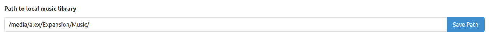
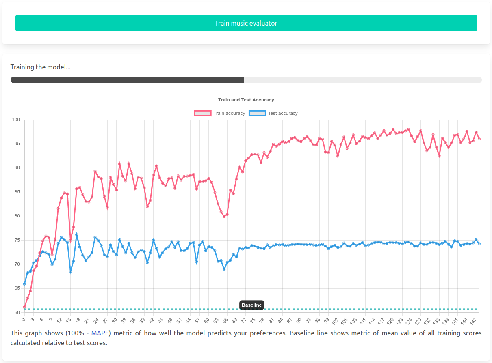

# Anagnorisis
Anagnorisis - is a local recommendation system that allows you to fine-tuned models on your data to predict your data preferences. You can feed it as much of your personal data as you like and not be afraid of it leaking as all of it is stored and processed locally on your own computer. 


The project uses [Flask](https://flask.palletsprojects.com/) libraries for backend and [Bulma](https://bulma.io/) as frontend CSS framework. This is the main technological stack, however there are more libraries used for specific purposes.


To read more about the ideas behind the project you can read this article:  
[Anagnorisis. Part 1: A Vision for Better Information Management.](https://medium.com/@AlexeyBorsky/anagnorisis-part-1-a-vision-for-better-information-management-5658b6aaffa0)


## Installation
Notice that the project has only been tested on Ubuntu 22.04, there is no guarantee that it will work on any other platforms. 


Recreate the Environment with following commands:  


    python3 -m venv .env  # recreate the virtual environment
    source .env/bin/activate  # activate the virtual environment
    pip install -r requirements.txt  # install the required packages


Initialize your database with this command:  


    flask --app flaskr init-db


This should create a new 'instance/project.db' file, that will store your preferences, that will be used later to fine-tune the model.  


Then run the project with command:  


    bash run.sh


The project should be up and running on http://127.0.0.1:5001/  
To change your media folder go to 'config,yaml' file and change 'music_page.media_directory' param to the path of your music folder.  


## Downloading the models
First of all make sure you have git-lfs installed (https://git-lfs.com).  
Then go to 'models' folder with  
```cd models```


**Music embedder: m-a-p/MERT-v1-95M**  
```git clone https://huggingface.co/m-a-p/MERT-v1-95M```


## General
Here is the main pipeline of working with the project:  
1. You rate some data such as text, audio, images, video or anything else on the scale from 0 to 10 and all of this is stored in the project database.  
2. When you acquire some amount of such rated data points you go to the 'Train' page and start the fine-tuning of the model so it could rate the data AS IF it was rated by you.  
3. New model is used to sort new data by rates from the model and if you do not agree with the scores the model gave, you simply change it.  


You repeat these steps again and again, getting each time model that better and better aligns to your preferences.  


## Music Page
1. Set up the path to your local music folder  



2. Go to the music library tab and press the "Update music library" button to index your music into the data-base.  


3. Enjoy your music and rate it according to your preferences. All unrated songs would be chosen randomly while already rated ones will be chosen less or more often accordingly.  


4. After gathering some data go to "Train" page and press "Train music evaluator" to train your preference model. Wait till the process is complete.  



Now you can come back to enjoying your music, but this time, when the music is selected it will be rated by the model (in case it was not rated by the user already) and therefore adjust the probability of it occurring in your playlist. If you want, you can also go back to the library tab and update music library again, that will effectively rate every song the model can in your library, although be ready that it may take some time.  


Notice, that only *.mp3 format could be rated by the model automatically for now.


To see how the algorithm works in details, please read this wiki page: [Music](wiki/music.md)


## Wiki
The project has its own wiki that is integrated into the project itself, you might access it by running the project, or simply reading it as markdown files.

Here is some pages that might be interesting for you:  
[Change history](wiki/change_history.md)  
[Philosophy](wiki/philosophy.md)  
[Music](wiki/music.md)  

---------------	
In memory of [Josh Greenberg](https://variety.com/2015/digital/news/grooveshark-josh-greenberg-dead-1201544107/) - one of the creators of Grooveshark. Long gone music service that had the best music recommendation system I've ever seen. 