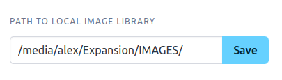
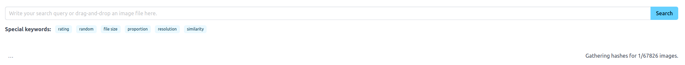
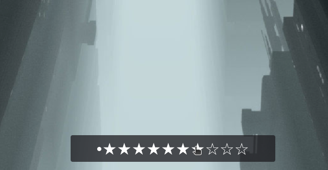
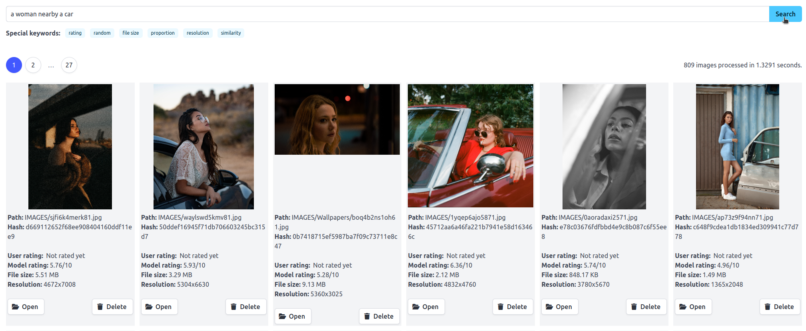
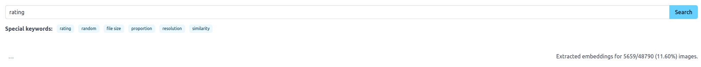
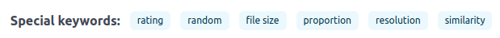
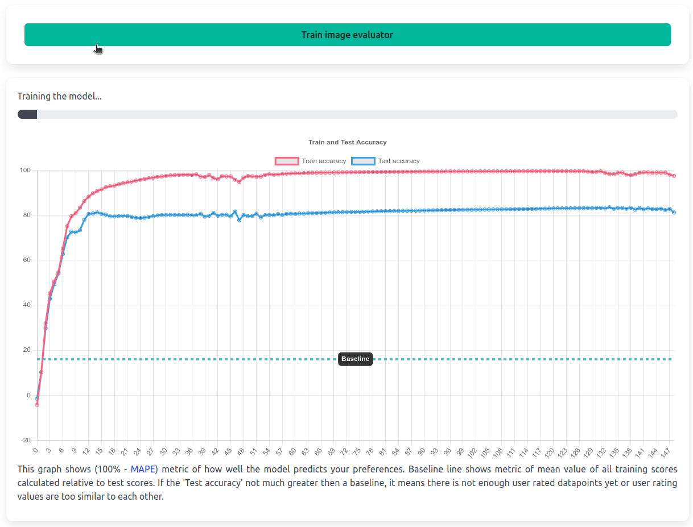

# Images module

## Introduction

To work with the **Images** module, first of all you have to set up a path to your local image library folder. You can do that by copying the path into the 'Path to local image library' field and pressing the **Save** button.  

After that you will see a message on the right that the system is gathering hashes of your images with the current status of how many images have been processed. This process is necessary to set up a caching system. For the first time it would take some time depending on the number of images in your library. It depends on your hardware, but per 10000 images expect it to take about 1 minute. When the hash gathering is complete a set of images would be presented on the screen.   

You can click on any image to see it in full size. When the image is enlarged there would be a rating bar on the bottom of the screen. With this bar you can rate how you like any particular image from 0 to 10. This rating would be stored in the database and later be used for training your personal image evaluation model.  

You can also search images by text. Just type the text into the search field and press the **Search** button. The system will show images that are most relevant to the search query.   

To perform semantic search the system needs to gather embeddings of the images. Again this process needs to be done only once per image. The process would take about 4 minutes per 10000 images depending on your hardware. When embeddings have been computed they are stored in the database for fast access.   

Besides semantic search there is also a possibility to filter images by rating, randomly, by a file size, proportion, resolution or similarity. All of this options are presented in the filtering section on top and need to be pressed to activate or can simply be entered as a text into the search field as a special key-word.  

When you collect some amount of ratings you can go to the **Train** page and press the **Train image evaluator** button to train the model that will rate images for you. This process would take some time again depending on your hardware. After the training process is complete you can go back to the **Images** page and see how the system rates images for you. When you now perform **Rating** based filtering the system will show you images that are most relevant to your preferences. Firstly by your rating and when it has not been rated yet by the model's rating.  

## Usage

Most of the options that **Images** module provides is designed to make it easier to clean big image datasets. 

### Text search
For example, you can use text search to find and filter all 'NSFW' or any other category of images you want to get rid of. 

### Similarity search
Next, similarity filtering is based on the cosine similarity between the embeddings of the images via fast clustering. This might be handy when you want to get rid of images duplicates or just images that are too similar to each other, as they will be placed side by side in the results. 

### Other filters
By filtering via **Resolution** you can get rid of images that are too small or too big for your needs.  
**Proportion** filtering is useful when you want to get rid of images that are too wide or too tall.  
**File size** filtering is useful when you want to get rid of images that are too heavy or too small.  
**Random** filtering may help you explore your dataset faster.  

### Rating based filtering
And finally **Rating** based filtering (when the evaluation model has been trained on some amount of your ratings) is useful when you want to get rid of bad or unpleasant images in your dataset.